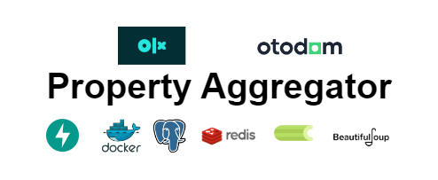
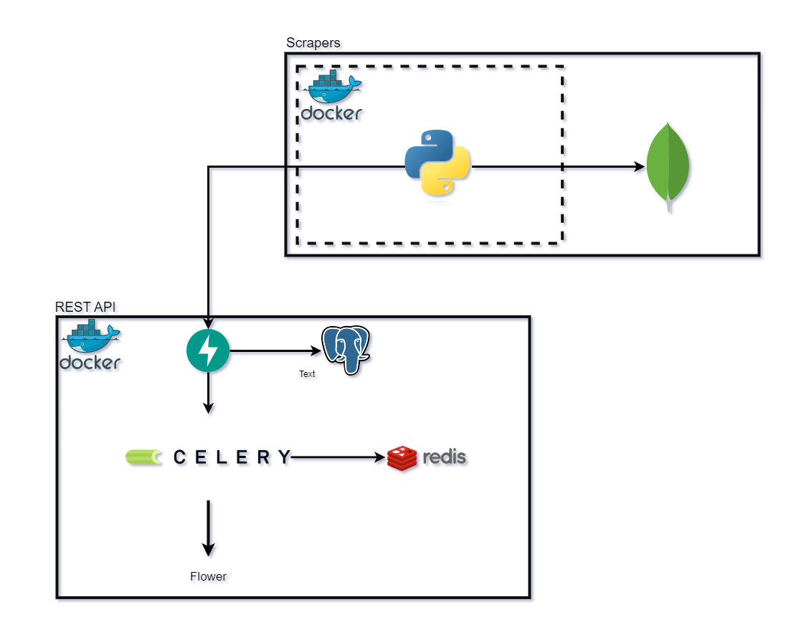
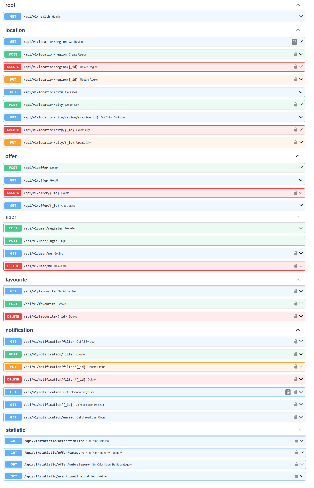
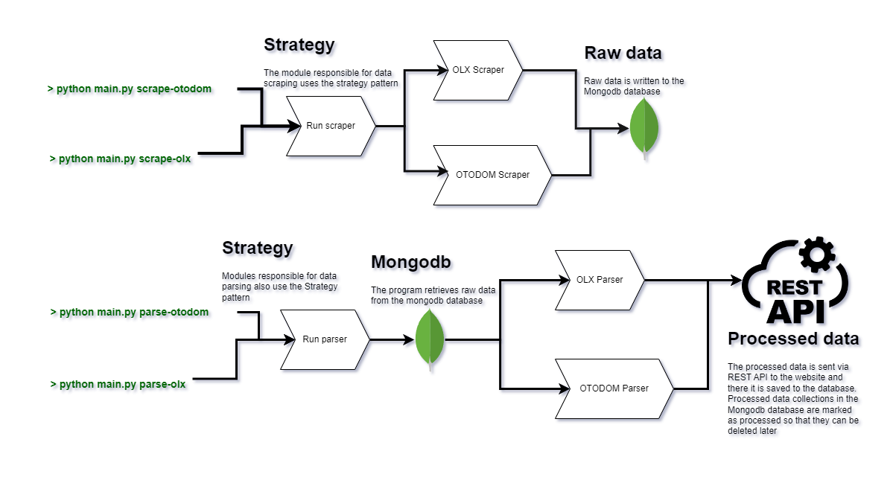

[![Contributors][contributors-shield]][contributors-url]
[![Forks][forks-shield]][forks-url]
[![Stargazers][stars-shield]][stars-url]
[![Issues][issues-shield]][issues-url]
[![MIT License][license-shield]][license-url]
[![LinkedIn][linkedin-shield]][linkedin-url]


<br />
<div align="center">
  <h3 align="center">Property aggregator</h3>
   <br>
  <strong align="center">
    Property aggregator is an application for collecting offers for the purchase or rental of apartments, houses, garages, premises and much more.
    The project consists of 2 main modules: RESTAPI, Scraper CLI application.
    The data is collected from the two largest advertising websites in Poland: OLX and Otodom
    <br />
    <br />
    <a href="https://github.com/DEENUU1/property-aggregator/issues">Report Bug</a>
    ·
    <a href="https://github.com/DEENUU1/property-aggregator/issues">Request Feature</a>
  </strong>
</div>


## About the project
This project consists of two separated modules:
1. A REST API interface built using FastAPI framework, utilizing a PostgreSQL database. Additionally, it employs Celery, Redis and Flower for Celery monitoring.
2. Scraper: A CLI application for scraping and processing data from platforms such as Otodom and OLX

### FastAPI


**Offer Filtering and Sorting**: Users can conveniently filter and sort offers based on various parameters to find the most relevant listings.

**JWT Implementation**: The application incorporates JSON Web Tokens (JWT) for secure authentication and authorization processes, ensuring data integrity and user privacy.

**Favorite Offer Saving**: Users have the option to save their preferred offers to a favorites list for easy access and tracking.

**Saved Filters** with Notifications: Users can save their applied filters, enabling them to receive daily notifications within the app and via email about new offers matching their specified criteria.

**Notification Management**: Users can view, modify, or delete saved filters and read notifications directly on the website. The application supports an unlimited number of filters to cater to diverse user preferences.

**Administrative Insights**: Administrators gain access to comprehensive statistics including:
- Total number of offers added in a specific month.
- Distribution of offers across different categories.
- Breakdown of offers available for sale or rent.
- Monthly user registration count.

**Tests**: In addition, the application is rigorously tested, with over 90 tests written using the pytest library. These tests cover both unit tests, examining the repository layer, and integration tests, evaluating appropriate endpoints in terms of various use cases and configurations. This ensures the reliability and robustness of the application's functionality across different layers and scenarios.


#### Offer list example output
```json
{
  "page": 1,
  "page_size": 15,
  "offers": [
    {
      "id": "90c0852c-b455-44cf-bf4b-847613a22096",
      "title": "Bezpośrednio | 2 pokoje | blok po remoncie",
      "details_url": "https://www.olx.pl/d/oferta/bezposrednio-2-pokoje-blok-po-remoncie-CID3-IDYXAxz.html",
      "category": "Mieszkanie",
      "sub_category": "Wynajem",
      "building_type": "Blok",
      "price": 5297.56,
      "rent": null,
      "description": "Bezpośrednio sprzedam mieszkanie 2 pokojowe o powierzchni 32,43m2.Mieszkanie w stanie do remontu - na podłodze parkiet (można zostawić). Okna PCV, nowe drzwi wejściowe.Położone w ścisłym centrum Sosnowca przy ul. Warszawskiej - 100m centrum handlowe Plaza, 100m dworzec i tzw. \"patelnia\". Mieszkanie znajduje się remontowanym przez naszą spółkę bloku w modernistycznym stylu z lat 30. Jest to budynek z cegły nie wielka płyta, ale stropy ma już betonowe, nie drewniane. Fajne i zdrowe budownictwo z wysokimi mieszkaniami.Zdjęcia przedstawiają stan przed remontem, więc wiemy jak pięknie będzie po remoncie. Biel i czerń uwydatni charakter budynku.Nasz zakres prac obejmuje: dach, wymiana instalacji elektrycznej, wymiana instalacji wodno-kanalizacyjnej, przygotowanie instalacji centralnego ogrzewania (bez grzejników), wykonanie nowej wentylacji mechanicznej, okna PCV, nowe drzwi wejściowe do mieszkań oraz remont klatki schodowej. Mieszkanie rozkładowe – okna na 2 strony (południowy wschód, południe i północny zachód).Znajduje się na 3 piętrze.Największym atutem są dwa balkony.Są wysokie i suche piwnice stanowiące części wspólne, które zostaną podzielone pomiędzy mieszkania.Stan prawny czysty - bez zadłużenia, bez hipoteki. Można finansować zarówno gotówką jak i kredytem. Jest to pełna własność z udziałem w gruncie. Opłaty na poziomie 8 zł/m2 (w tym 5zł/m2 fundusz remontowy).Wspólnota mieszkaniowa planuje 03.2025 uruchomić ogrzewanie miejskie oraz wyczyścić/ pomalować elewację (nie wymaga ona większych prac).W mieszkaniach jest już rozprowadzona instalacja. Można powiesić kocioł elektryczny, a potem go zdjąć i przepiąć instalację pod ogrzewanie miejskie. Bez żadnego kucia i niszczenia świeżo wyremontowanego mieszkania. Chętnie wytłumaczę na miejscu. Posiadam jeszcze inne mieszkania na innych piętrach. Zapraszam do oględzin na miejscu.Tel. (użyj formularza kontaktowego)PS. Jeśli nie odbieram, proszę o sms. Oddzwonię",
      "price_per_m": 5297.56,
      "area": 5297.56,
      "building_floor": 3,
      "floor": 3,
      "rooms": 2,
      "furniture": false,
      "photos": [
        {
          "url": "https://ireland.apollo.olxcdn.com:443/v1/files/cc5m6cdw1hw01-PL/image;s=768x1024"
        },
        {
          "url": "https://ireland.apollo.olxcdn.com:443/v1/files/srg924tenvr91-PL/image;s=420x822"
        },
        {
          "url": "https://ireland.apollo.olxcdn.com:443/v1/files/szguefj1v5up-PL/image;s=768x1024"
        },
        {
          "url": "https://ireland.apollo.olxcdn.com:443/v1/files/559sve3hm3u42-PL/image;s=768x1024"
        },
        {
          "url": "https://ireland.apollo.olxcdn.com:443/v1/files/wl6eizt9qxfo-PL/image;s=768x1024"
        }
      ],
      "city": {
        "id": "f465a495-2b7d-4d92-bb9f-8a1558fe1743",
        "name": "Sosnowiec",
        "region": {
          "id": "99bfa7c3-858d-4096-a4f1-ea734bee0a76",
          "name": "Śląskie"
        }
      },
      "created_at": "2024-03-24T23:33:53",
      "updated_at": "2024-03-24T23:33:53"
    },
```


### Scrapers


The "Scraper" is a **console application** designed to gather data from various advertising websites such as **OLX** and **Otodom**. 
It operates by utilizing the **requests** library to fetch data from these websites, after which the collected information is stored in a **MongoDB** database.
Following the initial data collection phase, the application retrieves the stored data from the NoSQL database. 
Subsequently, it undergoes parsing to extract the required information. 
Finally, utilizing an API interface, the parsed data is transmitted to a designated website where it is then saved to a PostgreSQL database.
This streamlined process ensures efficient extraction, storage, and transfer of data, facilitating seamless integration with the PostgreSQL database for further analysis and utilization.

#### Scraper commands
```text
delete-parsed-olx 

# This command allows to remove all parsed objects from MongoDB database in OLX collection
```

```text
delete-parsed-otodom 

# This command allows to remove all parsed objects from MongoDB database in Otodom collection
```

```text
scrape-otodom 

# This command allows to scrape data from otodom website
```

```text
scrape-olx 

# This command allows to scrape data from olx website 
```

```text
parse-otodom 

# This command allows to parse scraped data from otodom website
```

```text
parse-olx 

# This command allows to parse scraped data from olx website
```

## Technologies:
- Python
    - FastAPI
    - Celery
    - Flower
    - Pytest
    - Requests
    - Beautiful Soup 4
    - Typer
    - Alembic
- PostgreSQL
- Mongodb
- SQLite
- Docker
- Docker Compose
- Redis
- CI/CD


## Installation

### General
#### Clone repository
```bash
git clone https://github.com/DEENUU1/property-aggregator.git
```

#### Create .env file
```bash
cp .env_example .env
```


### REST API
#### Build docker-compose 
```bash
docker-compose -f docker-compose.dev.yml build
```

#### Run containers
```bash
docker-compose -f docker-compose.dev.yml up
```

#### Run tests
```bash
pytest 
```

### Scrapers
#### Build Docker image
```bash
docker build -f Dockerfile_scraper -t scraper .
```

#### Run specified command
```bash
docker run scraper scrape-olx
```

## Authors

- [@DEENUU1](https://www.github.com/DEENUU1)

<!-- LICENSE -->

## License

See `LICENSE.txt` for more information.


<!-- MARKDOWN LINKS & IMAGES -->
<!-- https://www.markdownguide.org/basic-syntax/#reference-style-links -->

[contributors-shield]: https://img.shields.io/github/contributors/DEENUU1/property-aggregator.svg?style=for-the-badge

[contributors-url]: https://github.com/DEENUU1/property-aggregator/graphs/contributors

[forks-shield]: https://img.shields.io/github/forks/DEENUU1/property-aggregator.svg?style=for-the-badge

[forks-url]: https://github.com/DEENUU1/property-aggregator/network/members

[stars-shield]: https://img.shields.io/github/stars/DEENUU1/property-aggregator.svg?style=for-the-badge

[stars-url]: https://github.com/DEENUU1/property-aggregator/stargazers

[issues-shield]: https://img.shields.io/github/issues/DEENUU1/property-aggregator.svg?style=for-the-badge

[issues-url]: https://github.com/DEENUU1/property-aggregator/issues

[license-shield]: https://img.shields.io/github/license/DEENUU1/property-aggregator.svg?style=for-the-badge

[license-url]: https://github.com/DEENUU1/property-aggregator/blob/master/LICENSE.txt

[linkedin-shield]: https://img.shields.io/badge/-LinkedIn-black.svg?style=for-the-badge&logo=linkedin&colorB=555

[linkedin-url]: https://linkedin.com/in/kacper-wlodarczyk

[basic]: https://github.com/DEENUU1/property-aggregator/blob/main/assets/v1_2/basic.gif?raw=true

[full]: https://github.com/DEENUU1/property-aggregator/blob/main/assets/v1_2/full.gif?raw=true

[search]: https://github.com/DEENUU1/property-aggregator/blob/main/assets/v1_2/search.gif?raw=true
